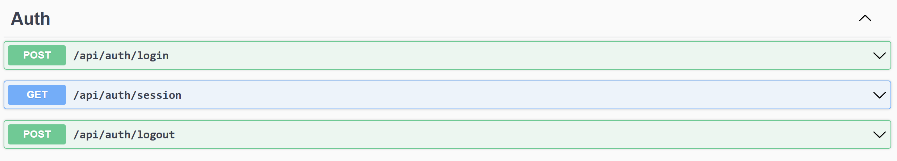
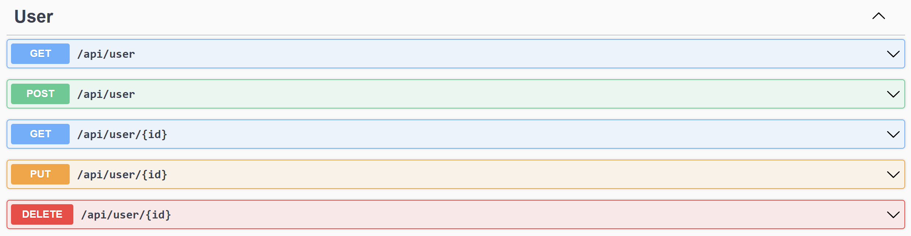
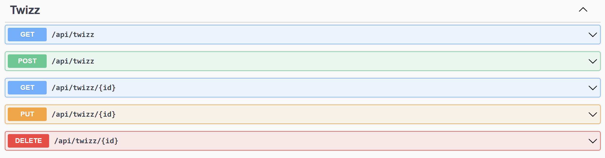
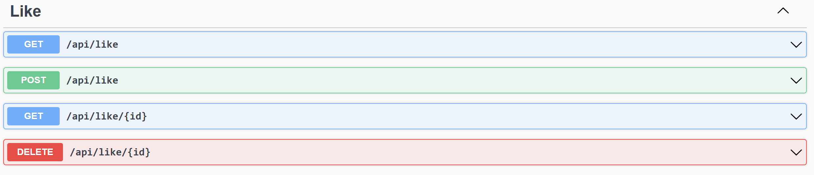
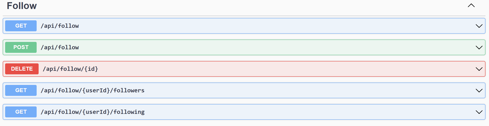
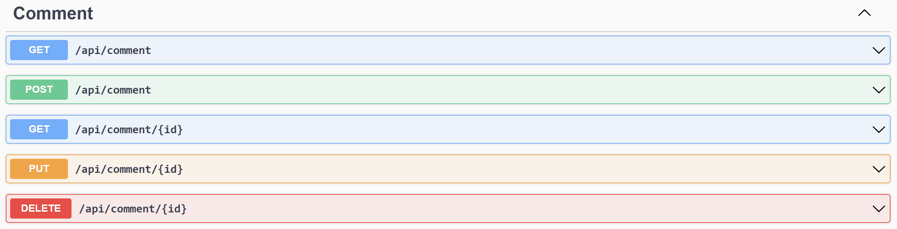

# twizzle-api

A Twitter clone REST API built with .Net 6, Entity Framework and Postgres SQL.

File uploads (will be) handled by Cloudindary.

## Routes

### Auth



### User



### Twizz (Tweet)



### Like



### Follow



### Comment



## Schemas

```go
Comment {
id	integer($int32)
userId	integer($int32)
twizzId	integer($int32)
content	string
nullable: true
parentCommentId	integer($int32)
nullable: true
createdAt	string($date-time)
updatedAt	string($date-time)
}

Follow {
id	integer($int32)
followerId	integer($int32)
followingId	integer($int32)
createdAt	string($date-time)
updatedAt	string($date-time)
}

Like {
id	integer($int32)
userId	integer($int32)
twizzId	integer($int32)
createdAt	string($date-time)
updatedAt	string($date-time)
}

Login {
email	string
nullable: true
password	string
nullable: true
}

Twizz {
id	integer($int32)
userId	integer($int32)
content	string
nullable: true
mediaURLs	[...]
createdAt	string($date-time)
updatedAt	string($date-time)
}

User {
id	integer($int32)
username	string
nullable: true
email	string
nullable: true
password	string
nullable: true
bio	string
nullable: true
avatarURL	string
nullable: true
createdAt	string($date-time)
updatedAt	string($date-time)
}

```
